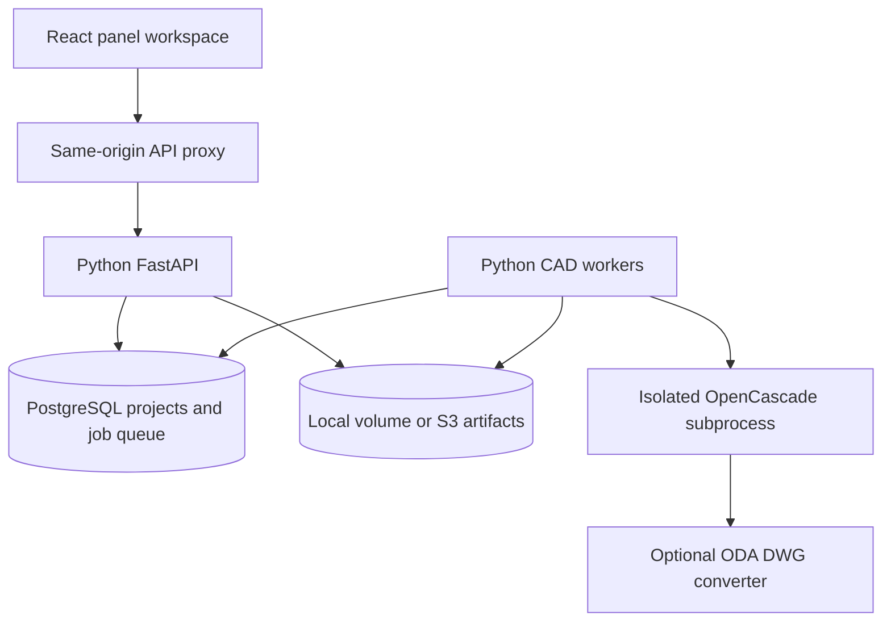
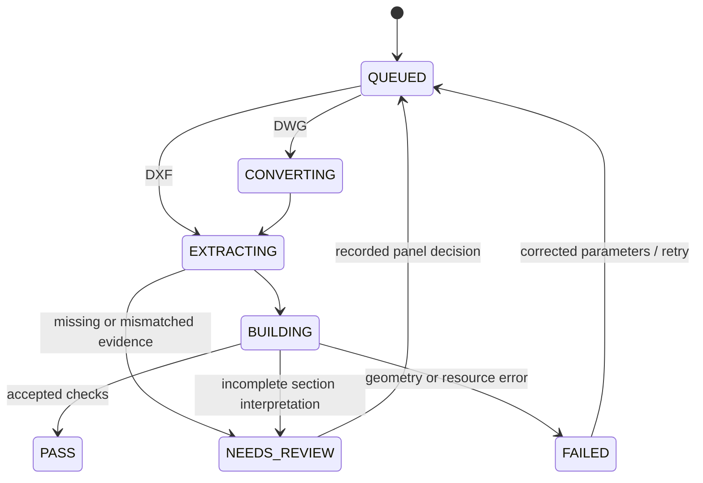

# FlatForge — architecture and operations

Version 1.0 · 19 September 2026

## Delivery status

FlatForge contains a React/TypeScript application and a working Python/OpenCascade conversion service. The private hosted website opens with three real, validated reference models. New uploads and persistent project editing require the Python service to be deployed and connected. Cloudflare Workers cannot execute this native CAD engine. The included Docker Compose stack runs the full application locally or on your own server.

The CAD engine was exercised against PN_PL_1570, PN_PL_1619 and PN_PL_1648. This is a constrained engineering implementation, not a universal interpretation of arbitrary fabrication drawings. It stops for missing or conflicting evidence. Previously confirmed exceptions remain explicit review decisions; they are not built into the generic engine.

## System boundary



| Component | Implementation | Responsibility |
| --- | --- | --- |
| Frontend | React, TypeScript, shadcn primitives | Projects, upload, review, calculations and viewer |
| Viewer | Three.js, GLTFLoader, OrbitControls | Mesh view of actual BREP, paint, bend hover, flat/folded motion, comparisons, PNG |
| GPU fallback | Canvas triangle renderer | Interactive mesh preview where WebGL is unavailable; approximate visibility/shading |
| Hosted proxy | Vinext / Cloudflare Worker routes | Server-held API key, same-origin streaming; never exposes the key to React |
| Self-hosted proxy | Nginx | Static React build and API forwarding |
| API | Python FastAPI, SQLAlchemy | Validation, settings snapshots, durable jobs, review records and exports |
| Database | PostgreSQL 16; SQLite for development | Projects, panels, revisions, queue claims, logs and worker heartbeat |
| CAD worker | Python process + bounded subprocess | Drawing parsing, section mapping, solid building and self-validation |
| Geometry | ezdxf, Shapely, CadQuery / OpenCascade | Planar topology, transforms and analytic-radius BREP construction |
| Artifacts | Mounted volume or S3-compatible store | Original drawing, STEP, GLB, STL, flat DXF/DWG, CSV, JSON and check images |

No language-model API is required. Geometry decisions are deterministic under the pinned runtime. The viewer is not the manufacturing geometry source: STEP comes from the native solid, while GLB/STL and PNG are derived viewing formats.

## Quick start — complete local application

Requirements: Docker Engine with Compose, approximately 8 GB available RAM, and sufficient disk for CAD dependencies and artifacts.

1. Copy `.env.example` to `.env`.
2. Generate **separate** random values for `FLATFORGE_API_KEY` and `POSTGRES_PASSWORD`. A URL-safe hexadecimal value avoids database-URL escaping issues:

   ```sh
   python -c "import secrets; print(secrets.token_hex(32))"
   ```

3. Run:

   ```sh
   docker compose up --build -d
   ```

4. Open `http://localhost:8080`. Create a project, select material defaults, upload a DXF, and watch the job progress.
5. View process logs with `docker compose logs -f api worker`. Stop without deleting data using `docker compose down`. Named volumes preserve projects and files.

Compose binds web and API ports to loopback. For remote use, place an authenticated HTTPS reverse proxy in front of the web service. Do not expose the Nginx web service publicly without authentication: it represents a single trusted workspace, not a multi-tenant account system.

The Docker build definitions are supplied; Docker itself was unavailable in the construction environment. Python execution, CAD integration tests, both frontend builds and browser interaction were checked directly.

## Connect the private hosted website

Deploy the Python API and worker on a native Linux container host with PostgreSQL and shared storage. Configure the hosted site's server-side environment:

- `FLATFORGE_API_URL`: HTTPS base URL of that API.
- `FLATFORGE_API_KEY`: the same random value configured on the Python API.

Redeploy the site after changing its server environment. The bootstrap endpoint switches from the clearly labelled sample workspace to your persistent projects when the service is available. If the API becomes unreachable, the hosted interface shows the sample workspace; it does not overwrite or erase backend projects. The local Docker frontend always connects to its API and displays a connection error if unavailable.

Do not put secrets in variables prefixed `VITE_` or `NEXT_PUBLIC_`, source files, URLs or browser storage.

## Drawing contract and supported geometry

- One developed sheet per file, drawing units millimetres. DXF units `0` are accepted under the explicit workspace millimetre convention; other non-mm unit codes stop for review.
- `CONTOR`: closed LWPOLYLINE outer contour; contained LWPOLYLINE/CIRCLE holes. Other entity forms require preprocessing. Curves are chord-approximated at 0.005 mm for planar operations; cylindrical bends remain analytic.
- `KIFOF`: **one LINE per bend axis**, never paired. Orthogonal axes only. A LINE may serve several disconnected tabs; multiple collinear entities can jointly describe a parent boundary. Counts of LINE entities, physical hinges and rigid faces are reported separately.
- `HAT`: orthogonal, paired-wall section linework, with the drawing's section and finish markers. `hat hide` is reference-only. `צבע` locates the finish side on the main face. Section paint triangles orient the profile. `OMEGA` entities are separate parts and are excluded.
- Named horizontal A-A/B-B/C-C cuts use paired `A-STRS-1` markers. Unnamed projected profiles use matching ordered strip lengths and vertex counts to find a geometric cut lane. This fallback is explicitly recorded as projected-profile matching, not an explicit cut marker.
- Current solid kernel workflow supports 90° bends and a connected, acyclic fold tree. Oblique axes, non-90° bends, malformed outlines, disconnected sheets and conflicting sections produce explicit errors. Folded-dimension input is flagged for a developed-pattern export; it is not silently treated as flat geometry.

## Reconstruction algorithm

1. Read DXF entities and required layers, validate contour closure, normalize to the outer contour minimum, and assign bend IDs in stable DXF-handle order.
2. Extend each axis by at most 3 mm at either end for relief gaps. Polygonize the outline and extended hinge supports. Keep non-hinge corner contacts in the report. Build adjacency, select the largest face as the provisional root, and require one connected tree. The paint marker must then agree with that root.
3. Do not silently discard unassigned axes. An interior rib or axis that fails to delimit a hinge requires review and is not used to cut the main face into an invented flange.
4. Recover paired HAT wall spacing. Infer thickness only when repeated spacings have an unambiguous dominant vote. Compare with the panel's settings snapshot; mismatches stop before solid construction.
5. Build section midline chains; find corresponding flat-face strips using cut markers or documented projected-profile matching. Vertex count and strip lengths must agree. Infer 90° bend deduction from consistent section-to-flat increments. Unknown evidence requires explicit parameter confirmation. Sharp schematic sections cannot establish an inside bend radius; radius remains the configured fabrication value.
6. Orient each section using its paint triangle. For consecutive unit directions `u,v`, the signed turn comes from `atan2(cross(u,v), dot(u,v))`, corrected by the measured finish-side handedness. Convert to the canonical parent-local +X/+Y axis and retain source profile, vertex and line handles.
7. Propagate a measured rotation only across disconnected tabs belonging to the **same original KIFOF entity**. Missing directions remain UNKNOWN. Different entities do not inherit angles merely because they look similar. Review choices are signed parent-local rotations, not ambiguous screen-space “up/down.”
8. Traverse the fold tree parent-first. For a 90° bend:

   ```text
   BA = 2(r + t) - BD
   K  = [BA/(π/2) - r] / t
   ```

   For t=2, r=2, BD=4: BA=4 mm and K≈0.2732395. Trim half of the developed bend strip from adjacent rigid faces, apply the signed rotation and tangent translation relative to the parent, extrude plates to thickness, and add analytic annular bend sectors. Fuse into one BREP solid.
9. Compare actual solid cuts against section chains (≤0.5 mm, ≤1°), inverse-map the solid's planar and cylindrical regions and compare to the blank (≤0.5% symmetric difference). Require one valid connected solid. Extra intersections in a full section plane require explicit acknowledgement when the drawing is a partial detail.
10. Export the final BREP to STEP. Tessellate that same solid for GLB/STL. Tag finish-facing surfaces and bend nodes. Export CSV source evidence and a JSON validation report. Canonicalize the STEP timestamp for repeatable bytes.

Finite corner contact regions use bend strips and Boolean union, not a full sheet-forming strain simulation. Their residuals are reported in the unfolding check. PASS is geometric agreement under these stated assumptions, not certification of manufacturability, tooling clearance or collision-free bend sequence.

## Workflow and state

Settings are global defaults. Uploads copy them into each panel, so editing defaults does not change previously uploaded sheets. Each review creates a new panel revision and job. Revision checks prevent stale worker output from replacing a newer decision.



Final STEP/STL/DWG download is blocked until PASS. Draft GLB and extraction artifacts may remain available for review. Project ZIP includes approved panels only. Manual dimensions are persisted with their selected flat/folded axis; the UI shows the signed difference from the computed dimension.

## API

All application endpoints require `X-Flatforge-Key`; `/health` is a minimal public liveness endpoint. The browser uses a same-origin proxy that supplies this header.

| Method and path | Purpose |
| --- | --- |
| GET `/bootstrap` | Defaults, projects, panels, worker availability |
| PUT `/settings` | New-upload defaults |
| POST `/projects` | Project/client creation |
| POST `/projects/{id}/upload` | Multipart files, validation, queueing |
| GET `/panels/{id}` | Current panel revision and report |
| GET `/panels/{id}/log` | Job history and bounded processing logs |
| POST `/panels/{id}/review` | Panel-only settings and signed bend decisions; requeue |
| PUT `/panels/{id}/measurement` | Manual value and comparison axis |
| GET `/panels/{id}/files/{name}` | Allowlisted revision artifact |
| GET `/projects/{id}/export` | Approved results ZIP |

OpenAPI is available from FastAPI at `/docs` on the direct API. Source upload accepts 1–20 files, at most 50 MB each by default; `MAX_UPLOAD_MB` changes the API limit. Hosted proxy/platform request limits can impose a lower effective **batch** maximum. Use smaller batches where necessary.

## DWG

DWG is proprietary and is not parsed by ezdxf. Install ODA File Converter from its official vendor under terms suitable for your deployment, in the API/worker image, and set `ODA_FILE_CONVERTER` to the executable path. This project does not bundle a converter or accept its license for you. Set `ODA_XVFB=1` and supply `xvfb-run` plus the vendor's Qt dependencies when its Linux build requires a display.

The adapter invokes folder conversion with `ACAD2018`, DXF/DWG output, no recursive scanning and audit enabled. Without ODA, DWG uploads are visibly held for review and DWG export is unavailable. The adapter is implemented but was not executed because ODA was not installed. DXF and STEP conversion were executed and verified.

## Persistence, deployment and scaling

- PostgreSQL queue claims use row locks with `SKIP LOCKED` plus a conditional status update. A worker handles one CAD subprocess at a time. Scale with `docker compose up -d --scale worker=4`; budget approximately 5 GB memory per worker plus API/database headroom.
- Workers heartbeat, enforce a default 600-second CPU/wall-time limit and 4096 MB address-space limit, and cap native math threads. A crashed lease can be retried once; resource failures are explicit. Configure `CAD_TIMEOUT_SECONDS` / `CAD_MEMORY_MB` on workers to suit panel complexity.
- Local artifacts use a shared durable volume. For workers on multiple hosts, configure `S3_BUCKET`, optional `S3_ENDPOINT`, AWS credentials/role and region consistently on API and workers. Buckets must remain private. Project ZIP assembly currently uses temporary local disk.
- API instances are stateless except for PostgreSQL and shared artifacts and can run behind a load balancer. Worker capacity is independent of API request traffic. No in-memory task queue is used.
- Metadata schema is initialized for v1 using SQLAlchemy `create_all`. Future schema changes require versioned migrations; do not rely on `create_all` to migrate columns.
- Back up PostgreSQL and source/result object storage together. Enable S3 versioning/lifecycle where appropriate, test restore, and retain revision/job provenance. There is no destructive cleanup endpoint in v1.
- Monitor job queue age, failed jobs, worker heartbeat age, wall time, disk/storage size and memory. Logs are available per job and through container stdout. External metrics collection and alerting are deployment work, not bundled services.
- v1 is a single trusted workspace protected by the private Site or your authenticated gateway. A shared API key is **not** tenant isolation. Public SaaS requires user authentication, tenant ownership checks on every query/object key, quotas/rate limiting, abuse protection and billing before launch.
- The bootstrap currently returns workspace metadata in one response. Add indexed server pagination and project-scoped fetching for very large catalogues. CAD worker scaling is implemented; unlimited UI/data-scale claims are not made.
- Native CAD processing is resource-bounded, not a hardened hostile-file sandbox. For untrusted public uploads, run workers in separately isolated, restricted containers/VMs with a minimal filesystem/network policy. The local/private workspace is the intended v1 deployment.

## Viewer details

Final model geometry is loaded from the solid's GLB in metres; displayed measurements and backend CAD coordinates remain millimetres with CAD Z-up. Flat-to-folded motion uses the same fold tree and parent transforms, with bend-strip allowance held constant. It is a kinematic visualization, not a tooling/bending-machine sequence simulation. A CPU fallback projects and sorts the same triangles for browsers without GPU contexts; complex overlapping faces may be less visually accurate than WebGL depth-buffer rendering.

Orbit, pan, zoom, camera presets, painted-face colour, wireframe and PNG snapshots are available. Compare mode accepts 2–5 panels with gap and near/centre/far alignment. The viewer does not fuse panels into a single manufacturing part. PNG downloads capture the current viewing state; STEP remains the native single-panel solid. Bend hover displays signed angle and source profile/vertex.

## Source map

```text
components/flatforge/     React workflow, types, WebGL/software viewers
app/api/                 Hosted same-origin proxy and sample bootstrap
backend/flatforge/api.py  FastAPI and validation/export policy
backend/flatforge/db.py   SQLAlchemy records
backend/flatforge/worker.py Durable queue and isolated job execution
backend/flatforge/engine.py Evidence, review, validation and export orchestration
backend/flatforge/geometry.py Generic drawing geometry and BREP algorithms
backend/flatforge/dwg.py  Optional ODA adapter
backend/flatforge/storage.py Local/S3 object interface
backend/tests/           End-to-end API/CAD regression
backend/scripts/         Reference fixture packaging
public/samples/          Three actual reference conversions and export archive
spa/                     Standalone React entrypoint
deployment/             Nginx and standalone frontend Dockerfile
compose.yaml             Full self-hosted stack
```

## Verification performed

| Drawing | Folded X / Y / Z (mm) | Hinges / faces | Required review decisions |
| --- | --- | --- | --- |
| PN_PL_1648 | 990 / 2917 / 55 | 12 / 13 | None |
| PN_PL_1570 | 2034 / 670 / 358 | 20 / 21 | C-C accepted as partial detail; chain matches, full plane has extra intersections |
| PN_PL_1619 | 2034 / 654 / 320 | 21 / 22 | Two previously confirmed lower-return directions, recorded as USER CONFIRMED |

The integration test uploads a real DXF with intentionally mismatched global thickness, verifies NEEDS_REVIEW, corrects only the panel, runs the actual bounded worker, verifies dimensions/unfolding, re-imports the exported STEP as one valid solid, downloads the project ZIP, checks manual measurement persistence, and rebuilds to assert identical STEP SHA-256. It also checks rejected authentication, malformed uploads and unknown export paths.

Run from the repository root after installing Python requirements and test dependencies:

```sh
PYTHONPATH=backend python -m pytest backend/tests -q
pnpm exec tsc --noEmit
pnpm exec vite build --config vite.spa.config.ts
```

The regression uses the included PN_PL_1648 source fixture. Test settings/database/storage are isolated in a temporary directory. CAD library versions are pinned; repeatability is required within the same pinned environment, not asserted across OpenCascade versions or operating systems.
